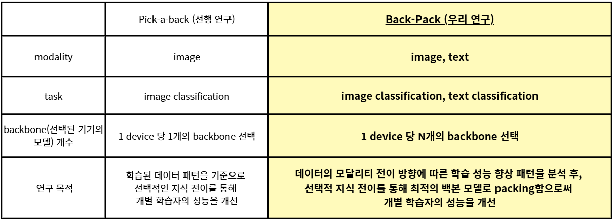
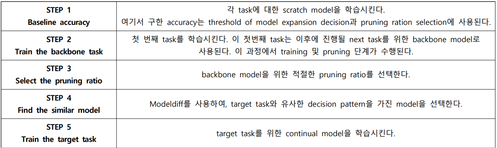
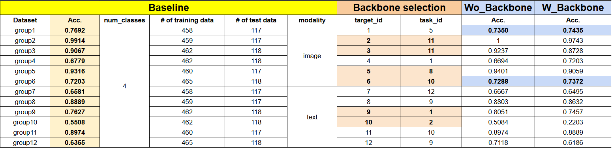
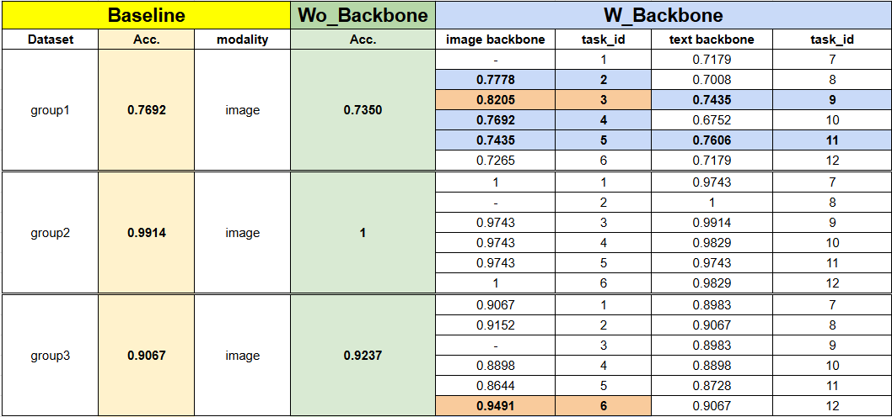
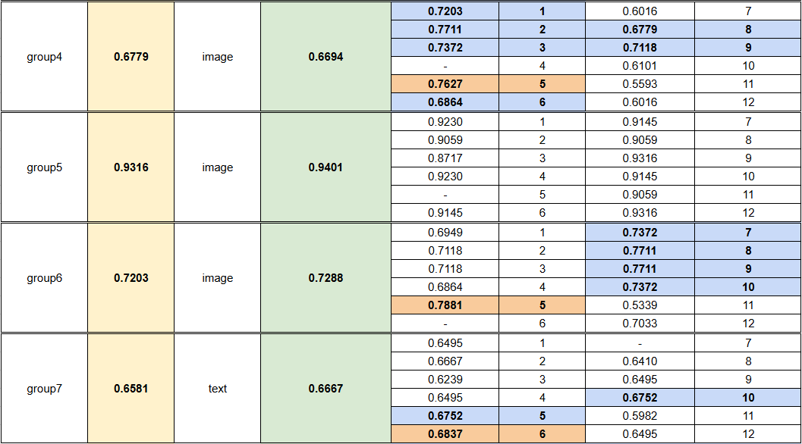
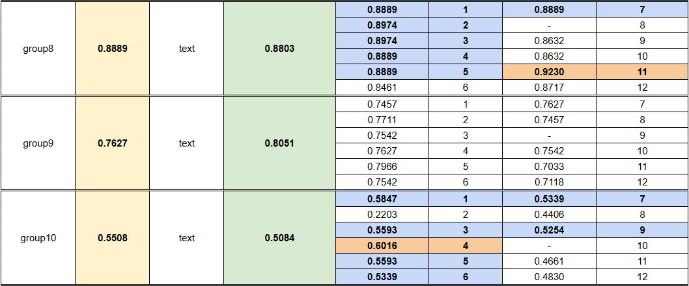
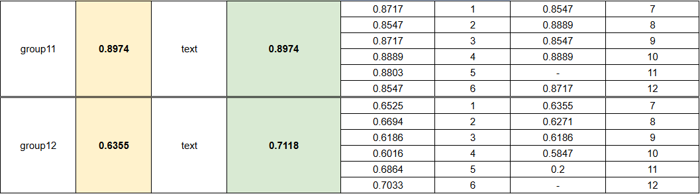
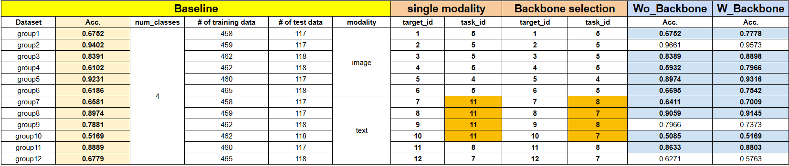

<!-- Template for PROJECT REPORT of CapstoneDesign 2025-2H, initially written by khyoo -->
<!-- 본 파일은 2025년도 컴공 졸업프로젝트의 <1차보고서> 작성을 위한 기본 양식입니다. -->
<!-- 아래에 "*"..."*" 표시는 italic체로 출력하기 위해서 사용한 것입니다. -->
<!-- "내용"에 해당하는 부분을 지우고, 여러분 과제의 내용을 작성해 주세요. -->

# Team-Info
| (1) 과제명 | Back-Pack: Collaborative Knowledge Transfer with Diverse Backbone Selection Beyond Modality |
|:---  |---  |
| (2) 팀 번호 / 팀 이름 | 07-테스파 |
| (3) 팀 구성원 | 조민주(2176359): 리더, Perceiver 모델 개발 및 실험, 실험 환경 관리, Multi-modal 실험환경 개발, 1:N Backbone model 구축 및 개발, Scalable Study   정지수(2176352): 팀원, Perceiver IO 모델 개발 및 실험, Dataset 전처리, Backbone model 선택 실험, Scalable Study   한유리(2271065) : 팀원, BEiT-3 모델 개발 및 실험, 실험 서버 관리, Dataset 호환성 관리, Backbone model 선택, 실험 설계 및 통계적 검정, Scalable Study			 |
| (4) 팀 지도교수 | 이형준 교수님 |
| (5) 과제 분류 | 연구 과제 |
| (6) 과제 키워드 | Continuous learning, 1:N Federated learning, Edge AI, Multi-modality  |
| (7) 과제 내용 요약 | 분산형 지속 학습 환경에서는 다양한 백본(backbone) 모델을 사용하는 각 디바이스 간에 과제(task)와 모달리티(image, text)를 넘나드는 지식 전이가 큰 도전 과제로 남아 있다.   본 연구에서는 Back-Pack이라는 협업 학습 프레임워크를 제안하여, 디바이스마다 여러 개의 backbone을 유지하면서 이미지와 텍스트 간, 혹은 동일 모달 내에서 선택적으로 지식을 다중전이할 수 있도록 한다.   우리는 지속적인 분류 학습 환경에서 지식 전이의 방향성에 따라 성능이 일관되게 향상되는 경향이 있음을 실험적으로 관찰하였고, 다수의 모델에서 추출한 지식을 하나의 백본에 융합(packing)할 경우 추가적으로 성능 향상을 확인하였다.   본 연구는 분산형 다모달 지속학습 환경에서 지식전이의 방향성과 모델 융합 전략이 핵심적인 요소임을 실증적으로 밝힌다. |

 

# Project-Summary
| 항목 | 내용 |
|:---  |---  |
| (1) 문제 정의 | 1. 이질적인 data와 다양한 modality, multiple task 환경에서 edge간 학습할 때 효율적인 Continual Learning 알고리즘 부재, Catastrophic Forgetting 문제 발생   2. decentralized 환경에서 raw data를 공유함으로써 발생하는 communicational/computational cost 문제   3. Cross/intra-modal backbone으로부터 knowledge transfer 시, 특정한 학습 패턴을 파악해볼 수 있을 것   4. device-to-device knowledge transfer 방식은 device간 collaborative한 transfer 방식보다 학습 효과가 낮을 것 |
| (2) 기존연구와의 비교 | - 선행 연구: Pick-a-back: Selective Device-to-Device Knowledge Transfer in Federated Continual Learning, ECCV24   - Pick-a-back(선행 연구)의 핵심 아이디어   1. 각 device가 데이터를 공유하지 않고 독립적으로 학습   2. 자신과 유사한 데이터 패턴을 가진 기기의 모델을 선택적으로 가져와서 자신의 지식을 전달   3. 기존의 Catastrophic Forgetting 문제를 방지하면서 continual learning 가능    |
| (3) 제안 내용 | 1) Multi-modality   다양한 모달리티의 데이터를 embedding space 상 표현하여 edge 간 전이   교차, 단일 모달 내 지식전이 실험: 특정 전이 방향이 지속적으로 학습 성능을 향상시키는지 검증   2) Decentralized Continual Learning   중앙 서버가 없는 환경에서 지속적으로 들어오는 task에 대해 Catastrophic Forgetting 현상을 최소화하는 알고리즘 구축   Decentralized Continual learning 환경 구축: backbone 모델로부터 지속적으로 task를 학습시킬 수 있도록 환경 구축   3) 1:N Knowledge Transfer algorithm   N개의 장치에서 학습한 지식을 그룹화하여 분류 후 장치끼리의 지식 전달하는 clustering 알고리즘 개발   모델 간 지식 융합 실험: 여러 모델의 지식을 하나의 모델로 통합하여 지식 전이했을 때 성능 향상이 있는지 검증 |
| (4) 기대효과 및 의의 | 데이터의 모달리티 전이 방향에 따른 학습 성능 향상 패턴을 분석 후, 선택적 지식 전이를 통해 최적의 백본 모델로 packing함으로써 개별 학습자의 성능을 개선 |
| (5) 주요 기능 리스트 | 1) MultiModality:   Multimodal 데이터를 처리하기 위해 이미지와 텍스트를 포함하는 데이터셋을 준비하고, 데이터셋을 전처리하여 몇 개의 그룹으로 준비한다. 이때 이미지 그룹과 텍스트 그룹은 절반씩 균등하다.   2) Decentralized Continual Learning:   각 데이터셋 그룹으로 모델을 학습시켜 서로 다르게 학습된 모델들을 decentralized 환경으로 준비시킨다. 각각의 모델 간의 modeldiff를 통해 모델 당 가장 적합한 backbone 모델을 탐색한다. 각각의 backbone모델의 데이터로 모델을 다시 학습시켜 성능향상이 있는지 확인한다. 해당 과정을 다양한 데이터셋과 모델로 반복하면서 모달리티 전이 방향에 따른 일정 패턴이 있는지 분석한다.   3) 1:N Knowledge Transfer algorithm:   모달리티 전이 방향에 따른 학습 성능 향상에 패턴이 있다면, 선택적 지식전이를 통해 다수의 backbone모델로 지속학습을 시켰을 때 하나의 backbone모델로 지속학습을 시켰을 때보다 성능이 향상되는지 검증한다.|

 
 
# Project-Design & Implementation
| 항목 | 내용 |
|:---  |---  |
| (1) 요구사항 정의 | 1) Multimodality: 이미지, 텍스트 모달리티를 포함한 데이터셋과 멀티 모달리티 데이터를 처리할 수 있는 모델을 준비한다.   데이터셋: cifar100(싱글 모달리티), mscoco, oxford-102-flowers, n24news, cub-200-2011(멀티 모달리티)   모델: Perceiver, PerceiverIO, Beit3   2) Decentralized Continual Learning: 각 데이터셋 그룹으로 학습시킨 모델을 하나의 task로 설정하여, target과 task 간의 modeldiff와 knowledge transfer를 하기 위한 환경을 구축한다.   3) 1:N Knowledge Transfer algorithm: 모달리티 전이 방향에 따른 패턴을 분석하고, 다수의 backbone 모델을 packing하기 위한 Knowledge Distillation 방법을 검증한다  |
| (2) 전체 시스템 구성 |  |
| (3) 주요엔진 및 기능 설계 | 1. Baseline(baseline): 목적-대조군.이후 지속학습을 위한 기반을 마련하기 위한 초기 학습 단계이다. 방법-각 task(데이터셋 그룹)로 모델을 학습시켰을 때의 성능을 확인한다. baseline.sh를 실행하여 packnet_cifar100_main_normal.py를 작동시킨다.   2. Without backbone(wo_backbone): 목적-실험군.단일 데이터로 지속학습한다. 방법-최적의 backbone을 탐색하지 않은 상태에서 backbone task를 학습시킨다. wo_backbone.sh를 실행하여 CPG_cifar100_main_normal.py를 작동시킨다.   3. Select pruning ratio(select_pruning_ratio_of_backbone): 목적-baseline 정확도를 사용하여 적절한 pruning ratio를 선택한다. 이 값은 지속학습을 수행할 때 기존 모델을 얼마나 가지치기할지 결정하기 위해 필요하다. 방법-select_pruning_ratio_of_backbone.sh를 실행하여 choose_appropriate_pruning_ratio_for_next_task_normfiles.py를 작동시킨다.   4. Find backbone(find_backbone): 목적-각 모델로 modeldiff하여 가장 데이터 패턴이 유사하여 적합한 모델을 backbone 모델로 선택한다. 방법-find_backbone.sh 실행하여 pickaback_cifar100.py를 작동시킨다.   5. transfer Key Value: 목적-perceiver 모델에 대해 modeldiff를 하기 위한 스크립트이다. 방법-백본 모델에 key value projection을 바꾸고 적합한 데이터 modality를 선택한다. transfer_kv.sh를 실행해서 transfer_kv.py를 실행한다.   6. With backbone(w_backbone): 목적-선택된 backbone으로 각 task를 지속학습시킨다. 방법-w_backbone.sh 실행하여 CPG_oxford_main_normal.py를 작동시킨다.    * Knowledge Distillation(KD_backbone): 새 모델을 구성하여, 선택한 Backbone으로부터 결정패턴을 학습하여 새로운 backbone을 구상한 후, 타겟의 로컬데이터로 Fine-tuning을 수행한다. 이 때, 데이터는 부모 모델의 local data, 학생 모델의 local data, 둘의 데이터 통합 - 세 가지 중 선택할 수 있다.|
| (4) 주요 기능의 구현 | [Multimodality와 Decentralized Continual Learning 기능 구현 및 실험 방법]   - Multi-modality 환경에서의 Backbone 선택 및 지식전이 실험 설계   1) (Image, Text, Class) 로 이루어진 Cross-modal dataset을 준비한다   2) Dataset을 modality와 class에 따라 N개의 Subgroup으로 나눈 후, 이것으로 model을 각각 학습시킨다.   3) Model 학습 시, 다양한 Continual Learning 방법을 사용한다.   4) 각 모델의 최적의 pruning ratio를 파악한다.   5) 학습시킨 모델 간의 유사도를 측정한다.   6) 가장 유사도가 높은 모델을 backbone으로 지정하여, 지식전이를 수행한다.     - Task: Multiclass classification   - Model: Perceiver: General Perception with Iterative Attention, PerceiverIO, Beit-3   - Modality에 따른 전처리기   - Text: BERT Tokenizer + embedding projection + positional encoding   - Image: Patchify, Fourier Encoding   - Attention layer에서 input의 key-value projection 추출, 교환 및 그에 따른 새로운 Pick-a-back 알고리즘   - 선행연구 코드에 본 연구 코드 적용 및 일부 모듈화     [데이터셋별 실험 setup]   1. N24News   - Image 6개 + Text 6개 = 12개   - 모델 별 클래스 수: 3개   2. Oxford 102 Flowers   - Image 6개 + Text 6개 = 12개   - 모델 별 클래스 수: 4개   3. MS COCO 2017   - Image 15개 + Text 15개 = 30개   - 모델 별 클래스 수: 4개   4. CUB   - Image 27개 + Text 27개 = 54개   - 모델 별 클래스 수: 5개     [Perceiver 실험결과]   1. oxford 데이터셋      (1) oxford 데이터셋은 group1-6은 image, group7-12는 text modality이다.   (2) backbone selection 결과를 보면(주황색 표시) 서로 다른 modality를 backbone 고른 경우를 확인할 수 있다.     2. oxford 데이터셋 전체 실행 결과               (1) 위의 표는 하나의 target_id에 대해 모든 task_id를 각각 backbone으로 골랐을 때의 성능을 기록한 것이다.   (2) without backbone에 비해 with backbone일 때 성능 향상이 있는 그룹은 1, 3, 4, 6, 7, 8, 10이다.   (3) 가장 성능 향상이 높은 backbone이 cross-modal인 경우: group10 (backbone 4)   (4) group10을 제외한 그룹에서는 intra-modal인 경우 성능 향상이 가장 높았다.     [Perceiver IO 실험결과]      (1) text modality일 때 backbone으로 image를 고른 경우가 많다.   (2) perceiver와 다르게 wo_backbone 보다 backbone을 사용한 w_backbone의 경우 성능이 향상된 그룹이 많다.   [Knowledge Distillation]   학습: 부모 모델과 동일한 backbone, 부모보다 축소된 backbone, 부모보다 확장된 backbone 두 가지를 준비한 후, 이를 각각 단일 부모에게서 지식전이를 받도록 학습시킨다. 이 때, 기존 코드와의 호환성을 위해 지속학습 기법을 사용한다.   지식전이 대상: perceiver IO 특성상 각각의 프로세스를 거치며 도출되는 latent vector와 최종 출력층으로 설정한다.   Loss function: 마지막 출력층은 Cross entropy, 각 프로세스별 도출되는 latent vector에는 cosine loss를 추가한다.   Dataset: 부모 로컬 데이터, 자식 로컬데이터, 둘의 데이터 concat - 세 가지 중 선택할 수 있다. 
| (5) 기타 | * 목표 학회가 변경됨에 따라, 논문 주제의 방향이 변경될 수 있음을 알립니다. |

 
